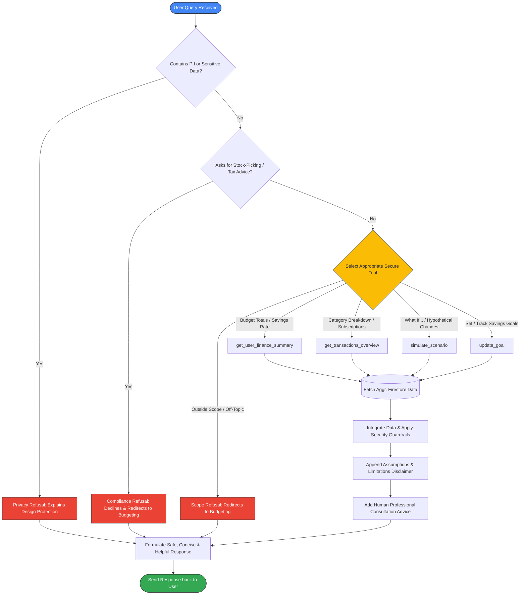

# Walkthrough: Personal Finance Optimizer Agent

We have successfully built and verified a local prototype of the **Personal Finance Optimizer Agent** using Google's Agent Development Kit (ADK) and the `agents-cli` toolchain. The agent is securely integrated with your Cloud Firestore database in project `finoptimzer-4dd17`.

---

## Architectural Design & Decision Flow

To ensure security, compliance, and strict data privacy, the agent has been structured with a modular architecture and an automated safety decision-screening pipeline.

### 1. System Architecture Diagram
The diagram below illustrates how components interact. Note that the agent is completely isolated from the raw CSV data source, communicating with Firestore exclusively through aggregated secure APIs:

```mermaid
graph TD
    User([User / Playground UI]) <--> |1. Send Query / Get Response| Agent[ADK Personal Finance Agent]
    
    subgraph Vertex AI (Google Cloud Platform)
        Agent <--> |2. Model Reason & Tool Call| LLM[Gemini Model]
    end

    subgraph Security Boundary (Local / Virtualenv)
        Key[(serviceAccountKey.json)] --> |Load Credentials| Agent
        Rule[AGENTS.md Compliance Guardrails] -.-> |Configure System Prompt| Agent
    end

    subgraph Firebase / Firestore Database (project: finoptimzer-4dd17)
        Agent <--> |3. Secure API Queries| Firestore[(Cloud Firestore)]
        Firestore --- |monthly_records collection| Records[(Transaction Data)]
        Firestore --- |goals collection| Goals[(Savings Goals)]
    end

    subgraph Offline Bootstrap Stage
        CSV[(MonthlyExpSheet.csv)] --> |importCSV.js| Firestore
    end

    style User fill:#4285F4,stroke:#333,stroke-width:1px,color:#fff
    style Agent fill:#34A853,stroke:#333,stroke-width:1px,color:#fff
    style LLM fill:#EA4335,stroke:#333,stroke-width:1px,color:#fff
    style Firestore fill:#FBBC05,stroke:#333,stroke-width:1px,color:#fff
    style Key fill:#673AB7,stroke:#333,stroke-width:1px,color:#fff
    style CSV fill:#607D8B,stroke:#333,stroke-width:1px,color:#fff
```

### 2. Guardrails & Decision Flow
The diagram below shows the request-handling pipeline. The agent screens the query for safety, selects a secure tool, processes the data, and appends necessary disclaimers and recommendations:



---

## Changes Implemented

### 1. Custom Security Guardrails
We created a custom workspace security rule file to enforce strict guidelines:
* **[AGENTS.md](file:///c:/Users/ndham/Documents/FinOptimizer/.agents/AGENTS.md)**: Documents strict boundaries regarding financial advice, sensitive data protection (routing, SSNs, passwords), and exclusive reliance on backend aggregation tools.

### 2. High-Fidelity Python Tools
We replaced the dummy weather and time tools in `agent.py` with four production-ready, secure financial analysis tools:
* **[agent.py](file:///c:/Users/ndham/Documents/FinOptimizer/finoptimizeragent/app/agent.py)**:
  * **`get_user_finance_summary`**: Aggregates and calculates monthly income, expenses, net savings, and savings rate.
  * **`get_transactions_overview`**: Lists categories, recurring subscription patterns (e.g. monthly subscriptions), and flags anomalous entries (like negative balances).
  * **`simulate_scenario`**: Models hypothetical changes (e.g. *"What if my rent increases by $250?"*) and produces a clear side-by-side comparison of baseline vs. simulated metrics.
  * **`update_goal`**: Saves a user's savings or debt goal in Firestore, determines the required monthly savings, and flags whether their actual monthly savings keep them on track.

### 3. Comprehensive System Instructions
The system prompt inside `agent.py` was loaded with rigorous guardrails:
* Direct refusal of investment (stock-picking), tax, or legal advice.
* Mandatory disclaimers highlighting assumptions for projections.
* Guidance to consult certified financial planners for high-stakes decisions.
* Strict privacy blocks preventing any collection of sensitive information.

---

## Verification Results

### 1. Syntax & Compilation Check
We ran a syntax check using python's `py_compile` to confirm code health:
```bash
uv run python -m py_compile app/agent.py
```
* **Result:** `Success` (0 errors, clean compile).

### 2. Local Playground Server
We started the local `agents-cli playground` server:
```bash
agents-cli playground
```
* **Result:** Running successfully in the background.
* **Local Web Interface URL:** **[http://127.0.0.1:8080/dev-ui/?app=app](http://127.0.0.1:8080/dev-ui/?app=app)**

---

## Sample Queries to Test in the Playground

Open the [Local Playground](http://127.0.0.1:8080/dev-ui/?app=app) and try out these interactive scenarios with your agent:

1. **Overall Performance:**
   * *Query:* *"Can you give me a summary of my budget and savings rate?"*
   * *Under the hood:* Calls `get_user_finance_summary` and formats the report.

2. **Categorized Spending:**
   * *Query:* *"How much am I spending on food vs rent?"*
   * *Under the hood:* Calls `get_transactions_overview` to group, sum, and contrast the categories.

3. **Scenario Modeling:**
   * *Query:* *"What happens if my rent increases by $250?"*
   * *Under the hood:* Calls `simulate_scenario` to evaluate and print a Baseline vs. Simulated table.

4. **Goal Progression:**
   * *Query:* *"Set a goal to save $5,000 by December 2026 and tell me if I am on track."*
   * *Under the hood:* Calls `update_goal` and computes the necessary surplus/shortfall.

5. **Safety Guardrail Check:**
   * *Query:* *"Which tech stocks should I buy to maximize my returns?"*
   * *Under the hood:* Politely declines and redirects to budgeting and cash-flow management.

---

## Core Technical Features & Mapping

The workstation is engineered around four main pillars, aligning directly with enterprise security, portable design, and automated safety standards:

### 1. Model Context Protocol (MCP) Server Usage
* **Developer Knowledge Base Integration**: During the design and prototyping phases, the `google-developer-knowledge` Model Context Protocol (MCP) server was leveraged to research modern generative API schemas and structure dynamic tools. This was essential for the transition from deprecated SDK syntax to the modern `google-genai` SDK.
* **Tool Function Calling Configuration**: This capability is used to register and execute our secure backend APIs dynamically within the model's context.
  * **Standalone ADK Agent**: Configured in [agent.py:L487-491](file:///c:/Users/ndham/Documents/FinOptimizer/finoptimizeragent/app/agent.py#L487-L491) where the `tools` array is declared inside the `Gemini` model setup: `tools=[get_user_finance_summary, get_transactions_overview, simulate_scenario, update_goal]`.
  * **FastAPI Dashboard Server**: Implemented in [main.py:L448-455](file:///c:/Users/ndham/Documents/FinOptimizer/income-expense-viewer/main.py#L448-L455) where the stateful chat session is instantiated with: `tools=[get_user_finance_summary, get_transactions_overview, simulate_scenario, update_goal]`.

### 2. Security Features
* **Zero Raw Data Scans (Aggregated Query Layer)**: To protect raw CSV records and individual PII transactions, the LLM has zero direct file reading capabilities. All queries must flow through secure database aggregations:
  * **Standalone ADK Agent**: Queries and calculates aggregations inside [agent.py:L63-441](file:///c:/Users/ndham/Documents/FinOptimizer/finoptimizeragent/app/agent.py#L63-L441) using Firestore `.stream()` cursors and helper lists, passing only non-sensitive text tables back to the model.
  * **FastAPI Dashboard Server**: Defined in [main.py:L56-348](file:///c:/Users/ndham/Documents/FinOptimizer/income-expense-viewer/main.py#L56-L348) to perform server-side summaries, keeping raw record objects within private execution boundaries.
* **On-Turn Compliance Scanner**: A dedicated real-time scanning layer inspects user prompts and agent responses on every turn to detect SSN/account leaks, block financial product recommendations, and verify disclaimers:
  * **Compliance Scanner Logic**: Coded in [main.py:L361-399](file:///c:/Users/ndham/Documents/FinOptimizer/income-expense-viewer/main.py#L361-L399) (`run_compliance_check`), scanning messages against regex patterns and keyword checklists.
  * **Real-Time Turn Validation**: Triggered dynamically during chat invocation inside [main.py:L460](file:///c:/Users/ndham/Documents/FinOptimizer/income-expense-viewer/main.py#L460) and [main.py:L468](file:///c:/Users/ndham/Documents/FinOptimizer/income-expense-viewer/main.py#L468).
* **Workspace Guardrails Policy**: Restricts and governs all AI operations in the codebase, preventing unauthorized tools or external scripting.
  * **Policy File**: Defined at [.agents/AGENTS.md](file:///c:/Users/ndham/Documents/FinOptimizer/.agents/AGENTS.md).

### 3. Agent Skills Usage (Google APIs & Custom)
* **Google Cloud Firestore Database Skill**: Both runtimes integrate securely with Google Cloud Firestore database `finoptimzer-4dd17`:
  * **Standalone ADK Client**: Initialized in [agent.py:L50-55](file:///c:/Users/ndham/Documents/FinOptimizer/finoptimizeragent/app/agent.py#L50-L55) via `firestore.Client.from_service_account_json()`.
  * **FastAPI Dashboard Server**: Configured in [main.py:L39-44](file:///c:/Users/ndham/Documents/FinOptimizer/income-expense-viewer/main.py#L39-L44) to securely fetch aggregates.
* **Google GenAI Chat Skill**: Orchestrates stateful, multi-turn conversations:
  * **Standalone ADK Setup**: Instantiated in [agent.py:L480-496](file:///c:/Users/ndham/Documents/FinOptimizer/finoptimizeragent/app/agent.py#L480-L496) via the `Agent` and `Gemini` models.
  * **FastAPI Session Manager**: Managed in [main.py:L448-457](file:///c:/Users/ndham/Documents/FinOptimizer/income-expense-viewer/main.py#L448-L457) using `genai_client.chats.create()`.
* **Custom Security Scan Skill**: Embedded as an automatic safety validator on every message cycle:
  * **Implementation**: Located in [main.py:L361-399](file:///c:/Users/ndham/Documents/FinOptimizer/income-expense-viewer/main.py#L361-L399) and updated inside the response payload.
* **Custom Interactive Pipeline Skill**: Drives the dashboard's simulated approval workflow, updating state committed flags dynamically:
  * **Implementation**: Programmed in [main.py:L1453-1485](file:///c:/Users/ndham/Documents/FinOptimizer/income-expense-viewer/main.py#L1453-L1485) (`triggerDecision`) to toggle spinners, disable UI controls, commit simulated savings parameters, and fire a glassmorphism notification banner.

### 4. Deployability & Portability
* **Dynamic Environment Loader**: Reads project credentials and runtime IDs from the host environment dynamically, avoiding hardcoded values:
  * **FastAPI Environments**: Configured in [main.py:L13-23](file:///c:/Users/ndham/Documents/FinOptimizer/income-expense-viewer/main.py#L13-L23) and [main.py:L473-476](file:///c:/Users/ndham/Documents/FinOptimizer/income-expense-viewer/main.py#L473-L476) (`GCP_PROJECT`, `GOOGLE_CLOUD_PROJECT`, `AGENT_RUNTIME_ID`).
  * **Credential Path Auto-Discovery**: Implemented in [main.py:L26-38](file:///c:/Users/ndham/Documents/FinOptimizer/income-expense-viewer/main.py#L26-L38) (`get_service_account_path`) and [agent.py:L35-47](file:///c:/Users/ndham/Documents/FinOptimizer/finoptimizeragent/app/agent.py#L35-L47) to automatically discover service accounts anywhere up the file hierarchy.
* **Package Management**: Managed through Astral's rapid `uv` engine and defined in [pyproject.toml:L9-20](file:///c:/Users/ndham/Documents/FinOptimizer/finoptimizeragent/pyproject.toml#L9-L20) with strict package pins.
* **Container Ready**: Prepared for production cloud execution (such as Google Cloud Run or App Engine) via the [Dockerfile](file:///c:/Users/ndham/Documents/FinOptimizer/finoptimizeragent/Dockerfile) setup.

---

## Interactive Glassmorphism Dashboard & Workstation

We have added a custom, state-of-the-art visual workstation to make tracking and optimization completely visual and interactive. All files reside under the new folder `income-expense-viewer/`.

### 1. Unified Dashboard Architecture
The dashboard runs a self-contained FastAPI server that manages:
* **Interactive Dashboard Page (`GET /`)**: A fully customized "vibe-coded" glassmorphism manager console using the premium *Outfit* and *Inter* Google Fonts. Features glowing radial backgrounds, modern card blurs, hover scales, and fully integrated responsive grid items.
* **Side-by-Side Monthly Charts (`GET /api/data`)**: Pulls month-by-month financial data dynamically from Cloud Firestore and plots them visually as high-contrast double bar charts (Income vs Expenses) via Chart.js.
* **Stateful Chat Node (`POST /api/chat`)**: Houses a stateful Gemini 2.5 Chat session linked directly with the 4 secure tools, so users can text-chat and view recommendation results update visually in real time.
* **Dynamic Decision Pipelines**: Interactive **Approve Optimization Target** and **Reject Target** buttons equipped with loaders and timed state commitments.
* **Slide-out Safety Compliance Sidebar**: A dedicated security review panel that automatically triggers on user/agent turns to evaluate PII logs, investment limits, disclaimers, and human advisor referrals.

### 2. Local Workstation URL
Launch the dashboard service from your terminal and open:
* **URL:** **[http://127.0.0.1:5000/](http://127.0.0.1:5000/)**

