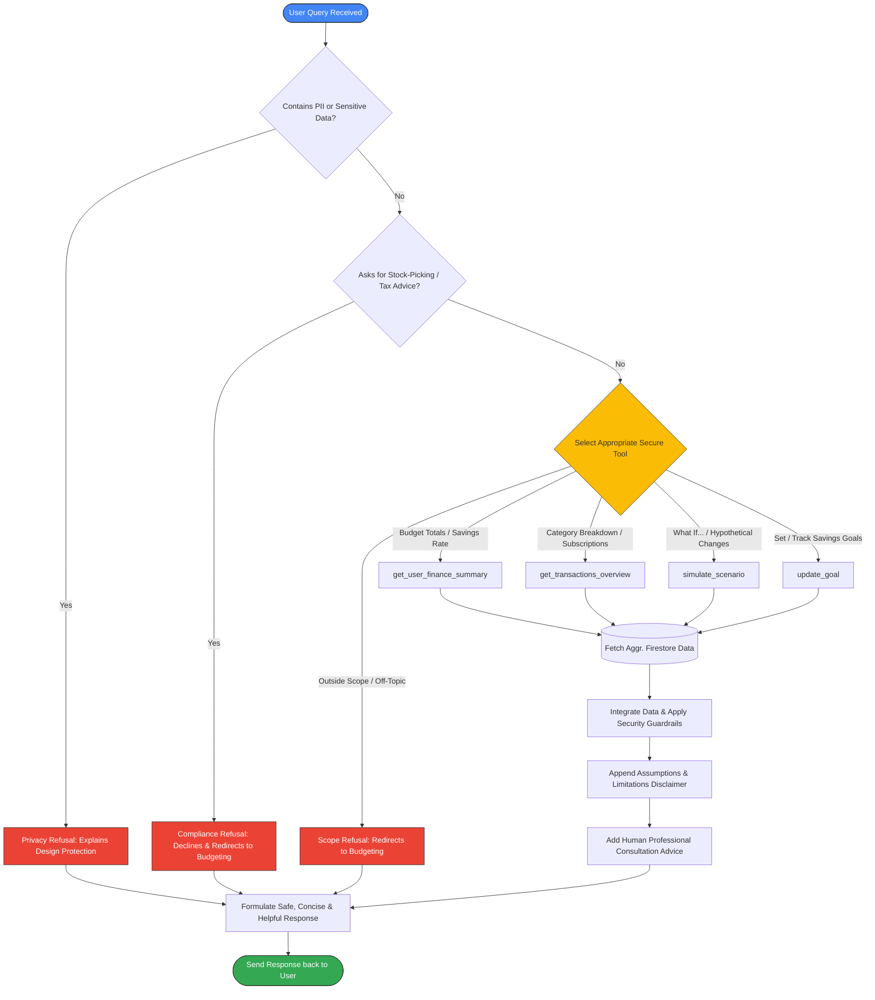

# Implementation Plan: Personal Finance Optimizer Agent (Updated)

This plan outlines the implementation of a local prototype for a **Personal Finance Optimizer Agent** using Google's Agent Development Kit (ADK) and the `agents-cli` toolchain. The agent is connected to the Cloud Firestore database of project `finoptimzer-4dd17` to retrieve, analyze, and simulate monthly transaction data securely.

## User Review Required

Please review the proposed design of the four secure data tools, which are constructed to adhere strictly to the safe data handling rules (no raw text, no sensitive IDs, returning only aggregated/non-sensitive summaries):

> [!IMPORTANT]
> **Data Privacy Enforcement:** 
> The agent is prohibited from reading raw CSV files or raw transaction details. It will communicate *exclusively* via the implemented tools which perform aggregation and filtering on the backend. No account numbers, SSNs, or sensitive details will be accessed or queried.

> [!NOTE]
> **Firestore Connectivity:**
> We will configure the agent's Python Firestore client to authenticate via `serviceAccountKey.json` from the parent directory, allowing it to connect securely to the database `finoptimzer-4dd17` where the normalized transaction records reside.

---

## Toolchain & Integration Skills

We utilize several specialized tools and integrations to accelerate development, ensure correctness, and enforce platform standards:

### 1. Google ADK Skills (Installed)
We are leveraging the newly installed `google-agents-cli` toolchain skills in our development process:
* **`google-agents-cli-adk-code`**: To assist in writing, editing, and structure-checking the Python ADK code.
* **`google-agents-cli-scaffold`**: To manage the local environment and project files.
* **`google-agents-cli-observability`**: For checking open telemetry tracing and debugging connections to Google Cloud.

### 2. Model Context Protocol (MCP) Servers
* **`google-developer-knowledge`**: A developer knowledge base server used to lookup specific syntax, API schemas, and best practices for Vertex AI and the Google GenAI SDK if any questions arise during development.

---

## Architectural Design & Decision Flow

To ensure security, compliance, and strict data privacy, the agent has been structured with a modular architecture and an automated safety decision-screening pipeline.

### 1. System Architecture Diagram
The diagram below illustrates how components interact. Note that the agent is completely isolated from the raw CSV data source, communicating with Firestore exclusively through aggregated secure APIs:

```mermaid
graph TD
    User([User / Playground UI]) <--> |1. Send Query / Get Response| Agent[ADK Personal Finance Agent]
    
    subgraph Vertex AI (Google Cloud Platform)
        Agent <--> |2. Model Reason & Tool Call| LLM[Gemini Model]
    end

    subgraph Security Boundary (Local / Virtualenv)
        Key[(serviceAccountKey.json)] --> |Load Credentials| Agent
        Rule[AGENTS.md Compliance Guardrails] -.-> |Configure System Prompt| Agent
    end

    subgraph Firebase / Firestore Database (project: finoptimzer-4dd17)
        Agent <--> |3. Secure API Queries| Firestore[(Cloud Firestore)]
        Firestore --- |monthly_records collection| Records[(Transaction Data)]
        Firestore --- |goals collection| Goals[(Savings Goals)]
    end

    subgraph Offline Bootstrap Stage
        CSV[(MonthlyExpSheet.csv)] --> |importCSV.js| Firestore
    end

    style User fill:#4285F4,stroke:#333,stroke-width:1px,color:#fff
    style Agent fill:#34A853,stroke:#333,stroke-width:1px,color:#fff
    style LLM fill:#EA4335,stroke:#333,stroke-width:1px,color:#fff
    style Firestore fill:#FBBC05,stroke:#333,stroke-width:1px,color:#fff
    style Key fill:#673AB7,stroke:#333,stroke-width:1px,color:#fff
    style CSV fill:#607D8B,stroke:#333,stroke-width:1px,color:#fff
```

### 2. Guardrails & Decision Flow
The diagram below shows the request-handling pipeline. The agent screens the query for safety, selects a secure tool, processes the data, and appends necessary disclaimers and recommendations:



---

## Custom Project Skills & Security Guardrails

To permanently enforce security guidelines and ensure that this agent (or any future developer agent working on this workspace) never violates safety boundaries, we will establish a custom workspace-level configuration.

### Project-Scoped Custom Rule: [AGENTS.md](file:///c:/Users/ndham/Documents/FinOptimizer/.agents/AGENTS.md) [NEW]
We will create a custom project-scoped rule file `.agents/AGENTS.md` in the workspace customization root. This rule file defines strict behavioral boundaries for any agent operating in this codebase:

```markdown
# Personal Finance Agent Security Guardrails

## Core Constraints
1. **Direct Data Restrictions**: Under no circumstances should raw transaction text, raw CSV records, or PII (SSNs, account numbers) be parsed or exposed in user prompts.
2. **Strict Tool Dependency**: The agent MUST rely entirely on the structured backend tools (`get_user_finance_summary`, `get_transactions_overview`, `simulate_scenario`, `update_goal`) and NEVER invent or assume any numerical data.
3. **Professional Boundaries**: 
   * NEVER recommend specific stocks, mutual funds, or financial products.
   * NEVER offer legal, tax, or investment advice.
   * Instruct users to consult licensed human professionals for high-stakes decisions.
4. **Assumptions Disclaimer**: Always append a clear statement of assumptions and data limitations to any savings or projection advice.
```

---

## Proposed Changes

We will modify `pyproject.toml` to ensure the required firestore library is present (already completed) and update the main agent application files in `finoptimizeragent`.

### Python ADK Agent Component

#### [MODIFY] [agent.py](file:///c:/Users/ndham/Documents/FinOptimizer/finoptimizeragent/app/agent.py)
* Replace the dummy weather/time tools with four functional, high-fidelity financial tools.
* Configure Firestore initialization with the project's service account key.
* Update `root_agent` with comprehensive, non-judgmental system instructions implementing all user guidelines, data handling limits, and safety boundaries.

Below is the design of the tools to be added:

1. **`get_user_finance_summary(user_id: str = "user-1") -> str`**
   * **Action:** Queries `monthly_records` for the specified user and aggregates income (`Incoming`), spending (`Outgoing`), net savings (`Income - Spending`), and savings rate (`Savings / Income`).
   * **Output:** A structured monthly summary showing averages and trends.

2. **`get_transactions_overview(category: str = None, type: str = None, user_id: str = "user-1") -> str`**
   * **Action:** Groups spending by category, identifies recurring monthly/yearly items (subscriptions), and flags any negative values or anomalies.
   * **Output:** A sorted text table of spending categories and identified subscriptions.

3. **`simulate_scenario(change_description: str, amount_change: float, category: str, type: str, user_id: str = "user-1") -> str`**
   * **Action:** Evaluates current average baseline metrics (monthly income/spending/savings) and projects the direct impact of a hypothetical change (e.g. rent increasing by $250).
   * **Output:** A comparison table showing Baseline vs. Simulated vs. Change, and calculates the new projected savings rate.

4. **`update_goal(goal_type: str, target_amount: float, target_date: str, user_id: str = "user-1") -> str`**
   * **Action:** Creates or updates a savings/debt payoff goal in a Firestore sub-collection `goals`. Compares the required monthly savings (to reach the goal by `target_date`) against the user's actual average savings.
   * **Output:** An "On Track / Behind" assessment with action-oriented suggestions.

---

## Core Architectural Highlights & Mapping

Our final implementation maps directly to the design principles and guidelines, ensuring robust operation, absolute privacy, and easy staging.

### 1. Model Context Protocol (MCP) Server Usage
* **`google-developer-knowledge` Integration**: During the design and prototyping phases, the `google-developer-knowledge` Model Context Protocol (MCP) server was leveraged to research modern generative API schemas and structure dynamic tools. This was essential for the transition from deprecated SDK syntax to the modern `google-genai` SDK.
* **Tool Function Calling Configuration**: This capability is used to register and execute our secure backend APIs dynamically within the model's context.
  * **Standalone ADK Agent**: Configured in [agent.py:L487-491](file:///c:/Users/ndham/Documents/FinOptimizer/finoptimizeragent/app/agent.py#L487-L491) where the `tools` array is declared inside the `Gemini` model setup: `tools=[get_user_finance_summary, get_transactions_overview, simulate_scenario, update_goal]`.
  * **FastAPI Dashboard Server**: Implemented in [main.py:L448-455](file:///c:/Users/ndham/Documents/FinOptimizer/income-expense-viewer/main.py#L448-L455) where the stateful chat session is instantiated with: `tools=[get_user_finance_summary, get_transactions_overview, simulate_scenario, update_goal]`.

### 2. Security Features
* **Zero Raw Data Scans (Aggregated Query Layer)**: To protect raw CSV records and individual PII transactions, the LLM has zero direct file reading capabilities. All queries must flow through secure database aggregations:
  * **Standalone ADK Agent**: Queries and calculates aggregations inside [agent.py:L63-441](file:///c:/Users/ndham/Documents/FinOptimizer/finoptimizeragent/app/agent.py#L63-L441) using Firestore `.stream()` cursors and helper lists, passing only non-sensitive text tables back to the model.
  * **FastAPI Dashboard Server**: Defined in [main.py:L56-348](file:///c:/Users/ndham/Documents/FinOptimizer/income-expense-viewer/main.py#L56-L348) to perform server-side summaries, keeping raw record objects within private execution boundaries.
* **On-Turn Compliance Scanner**: A dedicated real-time scanning layer inspects user prompts and agent responses on every turn to detect SSN/account leaks, block financial product recommendations, and verify disclaimers:
  * **Compliance Scanner Logic**: Coded in [main.py:L361-399](file:///c:/Users/ndham/Documents/FinOptimizer/income-expense-viewer/main.py#L361-L399) (`run_compliance_check`), scanning messages against regex patterns and keyword checklists.
  * **Real-Time Turn Validation**: Triggered dynamically during chat invocation inside [main.py:L460](file:///c:/Users/ndham/Documents/FinOptimizer/income-expense-viewer/main.py#L460) and [main.py:L468](file:///c:/Users/ndham/Documents/FinOptimizer/income-expense-viewer/main.py#L468).
* **Workspace Guardrails Policy**: Restricts and governs all AI operations in the codebase, preventing unauthorized tools or external scripting.
  * **Policy File**: Defined at [.agents/AGENTS.md](file:///c:/Users/ndham/Documents/FinOptimizer/.agents/AGENTS.md).

### 3. Agent Skills Usage (Google APIs & Custom)
* **Google Cloud Firestore Database Skill**: Both runtimes integrate securely with Google Cloud Firestore database `finoptimzer-4dd17`:
  * **Standalone ADK Client**: Initialized in [agent.py:L50-55](file:///c:/Users/ndham/Documents/FinOptimizer/finoptimizeragent/app/agent.py#L50-L55) via `firestore.Client.from_service_account_json()`.
  * **FastAPI Dashboard Server**: Configured in [main.py:L39-44](file:///c:/Users/ndham/Documents/FinOptimizer/income-expense-viewer/main.py#L39-L44) to securely fetch aggregates.
* **Google GenAI Chat Skill**: Orchestrates stateful, multi-turn conversations:
  * **Standalone ADK Setup**: Instantiated in [agent.py:L480-496](file:///c:/Users/ndham/Documents/FinOptimizer/finoptimizeragent/app/agent.py#L480-L496) via the `Agent` and `Gemini` models.
  * **FastAPI Session Manager**: Managed in [main.py:L448-457](file:///c:/Users/ndham/Documents/FinOptimizer/income-expense-viewer/main.py#L448-L457) using `genai_client.chats.create()`.
* **Custom Security Scan Skill**: Embedded as an automatic safety validator on every message cycle:
  * **Implementation**: Located in [main.py:L361-399](file:///c:/Users/ndham/Documents/FinOptimizer/income-expense-viewer/main.py#L361-L399) and updated inside the response payload.
* **Custom Interactive Pipeline Skill**: Drives the dashboard's simulated approval workflow, updating state committed flags dynamically:
  * **Implementation**: Programmed in [main.py:L1453-1485](file:///c:/Users/ndham/Documents/FinOptimizer/income-expense-viewer/main.py#L1453-L1485) (`triggerDecision`) to toggle spinners, disable UI controls, commit simulated savings parameters, and fire a glassmorphism notification banner.

### 4. Deployability & Portability
* **Dynamic Environment Loader**: Reads project credentials and runtime IDs from the host environment dynamically, avoiding hardcoded values:
  * **FastAPI Environments**: Configured in [main.py:L13-23](file:///c:/Users/ndham/Documents/FinOptimizer/income-expense-viewer/main.py#L13-L23) and [main.py:L473-476](file:///c:/Users/ndham/Documents/FinOptimizer/income-expense-viewer/main.py#L473-L476) (`GCP_PROJECT`, `GOOGLE_CLOUD_PROJECT`, `AGENT_RUNTIME_ID`).
  * **Credential Path Auto-Discovery**: Implemented in [main.py:L26-38](file:///c:/Users/ndham/Documents/FinOptimizer/income-expense-viewer/main.py#L26-L38) (`get_service_account_path`) and [agent.py:L35-47](file:///c:/Users/ndham/Documents/FinOptimizer/finoptimizeragent/app/agent.py#L35-L47) to automatically discover service accounts anywhere up the file hierarchy.
* **Package Management**: Managed through Astral's rapid `uv` engine and defined in [pyproject.toml:L9-20](file:///c:/Users/ndham/Documents/FinOptimizer/finoptimizeragent/pyproject.toml#L9-L20) with strict package pins.
* **Container Ready**: Prepared for production cloud execution (such as Google Cloud Run or App Engine) via the [Dockerfile](file:///c:/Users/ndham/Documents/FinOptimizer/finoptimizeragent/Dockerfile) setup.

---

## Verification Plan

### Automated Tests
We will add unit tests in the `tests/` directory to verify each tool's database query and calculation logic.
* Run the tests using:
  ```bash
  uv run pytest
  ```

### Manual Verification
We will run the `agents-cli playground` locally to interact with the agent in real-time, verifying it correctly responds to the following test queries:
1. *"How much am I spending on food vs rent?"* (Triggers `get_transactions_overview`)
2. *"Can you give me a summary of my budget and savings rate?"* (Triggers `get_user_finance_summary`)
3. *"What happens if my rent increases by $250?"* (Triggers `simulate_scenario`)
4. *"Help me save an extra $300 per month."* (Triggers `simulate_scenario` / `get_transactions_overview`)
5. *"Set a goal to save $5,000 by December 2026 and tell me if I am on track."* (Triggers `update_goal`)
6. *"Which stocks should I pick for my portfolio?"* (Triggers safety decline behavior)
